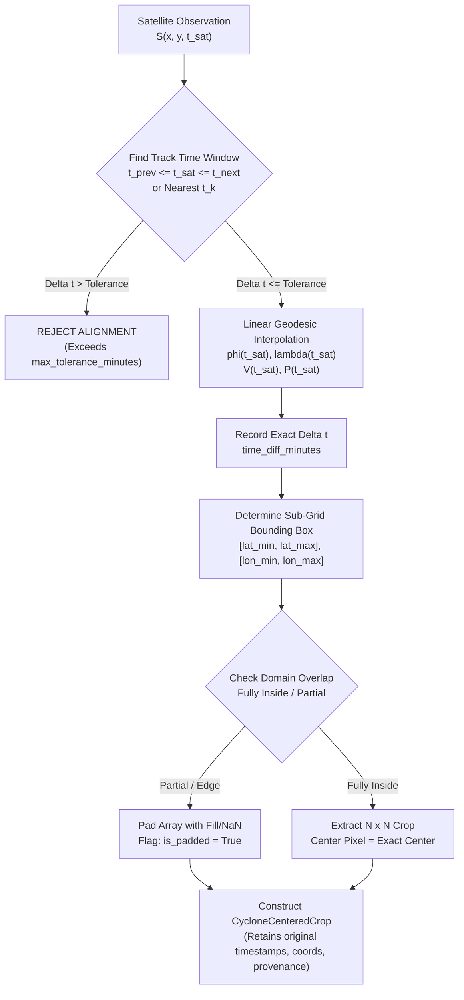

# CycloneGuard — Spatio-Temporal Alignment & Extraction Methodology

**Document Version:** 1.0.0  
**Phase:** Sprint 4 — Multi-Source Satellite Data Architecture & Ingestion  
**Standard:** Rigorous Physical Georeferencing & Non-Destructive Quality Control  

---

## 1. Mathematical Formulation of Spatio-Temporal Alignment

The core challenge in satellite tropical cyclone analytics is coupling asynchronous, spatial continuous satellite rasters $\mathcal{S}(x, y, t_{\text{sat}})$ with discrete, synoptic best-track point observations $\mathcal{T}_i = (t_i, \phi_i, \lambda_i, V_i, P_i)$, where:
* $t_{\text{sat}}$ is the satellite scan start timestamp (UTC).
* $\phi_i, \lambda_i$ are the storm center latitude and longitude.
* $V_i$ is maximum sustained wind speed (knots).
* $P_i$ is minimum central pressure (mb / hPa).

---

## 2. Temporal Alignment Engine (`TemporalAligner`)

Implemented in [`ml/data/alignment/temporal.py`](file:///c:/Users/maaz2/OneDrive/Desktop/storm/ml/data/alignment/temporal.py):

### 2.1 Search & Tolerance Protocol
1. For any target observation at timestamp $t_{\text{target}}$, the aligner searches the chronologically sorted track point series $\mathcal{T}$.
2. If an exact synoptic timestamp match exists ($|t_{\text{target}} - t_k| = 0$), that point is selected with `time_diff_minutes = 0.0`.
3. If $t_{\text{target}}$ lies between bracket points $(t_a, t_b)$, the aligner determines the fractional offset:
   $$\alpha = \frac{t_{\text{target}} - t_a}{t_b - t_a} \quad (0 < \alpha < 1)$$
4. If $t_{\text{target}}$ lies outside the bounding range, the nearest terminal point $t_{\text{near}}$ is evaluated with $\Delta t = |t_{\text{target}} - t_{\text{near}}|$.
5. **Rejection Rule:** If $\Delta t > \tau_{\text{tol}}$ (where $\tau_{\text{tol}}$ defaults to $180\,\text{minutes}$ / 3 hours), the alignment is **rejected** and returns `None`. No silent pairing of out-of-window observations is ever permitted.

### 2.2 Linear Geodesic Interpolation
When $\Delta t \le \tau_{\text{tol}}$ and $t_a < t_{\text{target}} < t_b$:
* **Latitude:** $\phi(t) = \phi_a + \alpha (\phi_b - \phi_a)$
* **Longitude:** $\lambda(t) = \lambda_a + \alpha (\lambda_b - \lambda_a)$ (accounting for $180^\circ$ meridian crossing if applicable)
* **Wind Speed:** $V(t) = V_a + \alpha (V_b - V_a)$ (if both valid)
* **Central Pressure:** $P(t) = P_a + \alpha (P_b - P_a)$ (if both valid)

---

## 3. Spatial Crop Engine (`SpatialAligner`)

Implemented in [`ml/data/alignment/spatial.py`](file:///c:/Users/maaz2/OneDrive/Desktop/storm/ml/data/alignment/spatial.py):

### 3.1 Coordinate Transformation & Index Mapping
Given a 2D regular geographic coordinate grid $(\Phi, \Lambda)$ where $\phi \in [\phi_{\min}, \phi_{\max}]$ and $\lambda \in [\lambda_{\min}, \lambda_{\max}]$:
1. Locate nearest integer grid index $(r_{\text{center}}, c_{\text{center}})$ to the storm center $(\phi_c, \lambda_c)$:
   $$r_{\text{center}} = \arg\min_r |\Phi[r] - \phi_c|, \quad c_{\text{center}} = \arg\min_c |\Lambda[c] - \lambda_c|$$
2. For an output crop dimension of $H \times W$ (e.g., $101 \times 101$ pixels):
   $$r_{\text{start}} = r_{\text{center}} - \lfloor H/2 \rfloor, \quad r_{\text{end}} = r_{\text{start}} + H$$
   $$c_{\text{start}} = c_{\text{center}} - \lfloor W/2 \rfloor, \quad c_{\text{end}} = c_{\text{start}} + W$$

### 3.2 Boundary Handling & Padding Rules
* If the storm center is proximate to the satellite field boundary such that $[r_{\text{start}}, r_{\text{end}}]$ or $[c_{\text{start}}, c_{\text{end}}]$ exceeds source boundaries:
  * The valid overlapping region is sliced.
  * The output array is pre-allocated with `NaN` (or fill value $0.0$).
  * The valid slice is inserted into the matching sub-region of the crop.
  * The metadata flag `is_padded = True` is permanently recorded in [`CycloneCenteredCrop`](file:///c:/Users/maaz2/OneDrive/Desktop/storm/ml/data/schemas/satellite.py).

---

## 4. Multi-Temporal Sequence Construction

Implemented in [`ml/data/sequences/sequence_builder.py`](file:///c:/Users/maaz2/OneDrive/Desktop/storm/ml/data/sequences/sequence_builder.py):

Future deep learning models (Sprint 5+) require temporal history to capture eye contraction, baroclinic deepening, and convective burst evolution.
* **Standard Synoptic Sequence:** $[t_{-12h}, t_{-6h}, t_{-3h}, t_0]$
* **Dynamic Cadence Rule:** If satellite imagery is missing at an exact synoptic time, the sequence builder dynamically searches within a configurable tolerance window ($\pm 60\,\text{min}$) around the nominal step.
* If a frame is completely absent, it is not artificially hallucinated or filled with random noise; the sequence is flagged as having incomplete history.

---

## 5. Rapid Intensification (RI) Ground-Truth Labeling

Implemented in [`ml/data/sequences/ri_label.py`](file:///c:/Users/maaz2/OneDrive/Desktop/storm/ml/data/sequences/ri_label.py):

### 5.1 Operational Definition
Consistent with the World Meteorological Organization (WMO) and National Hurricane Center (NHC) standard meteorological convention:
$$\text{Rapid Intensification (RI)} \iff \Delta V_{24h} = V(t_0 + 24\text{h}) - V(t_0) \ge 30\,\text{knots}$$

### 5.2 Verification & Missing Label Handling
* If the cyclone dissipates, makes landfall, or moves out of the best-track observing domain within the 24-hour forecast window such that $V(t_0 + 24\text{h})$ is unavailable:
  * The label is recorded as `None` / `UNAVAILABLE`.
  * **Critical Scientific Rule:** It is **strictly prohibited** to infer, extrapolate, or fabricate future intensity values. Unlabeled frames must not be used as negative examples in binary classification.
