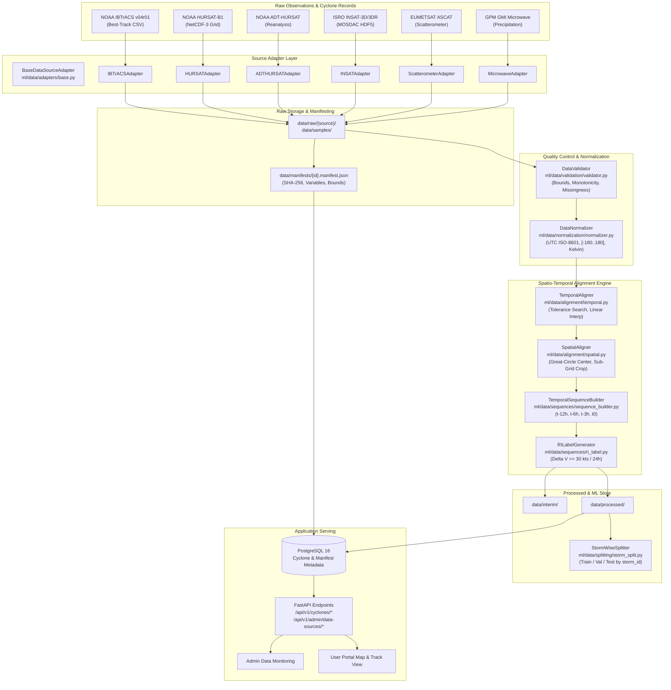

# CycloneGuard — Data Architecture & Ingestion Pipeline

**Document Version:** 1.0.0  
**Phase:** Sprint 4 — Multi-Source Satellite Data Architecture & Ingestion  
**Status:** Verified Operational Foundation  

---

## 1. Executive Summary

CycloneGuard requires a high-integrity, scientifically grounded data foundation to ingest, validate, normalize, spatio-temporally align, store, and serve multi-platform satellite and in-situ observations of tropical cyclones.

This architecture enforces **zero data fabrication**, strict source provenance tracking via SHA-256 manifests, non-destructive inspection, and complete decoupling between relational metadata storage (PostgreSQL) and multidimensional numerical datasets (NetCDF/NumPy array stores).

---

## 2. Core Data Flow



---

## 3. Directory Layout & Storage Hierarchy

```
storm/
├── data/
│   ├── raw/                       # Immutable raw ingest archives (.gitignored)
│   │   ├── insat/                 # ISRO MOSDAC HDF5 downloads
│   │   ├── hursat/                # NOAA NCEI HURSAT-B1 NetCDF-3 archives
│   │   ├── ibtracs/               # NOAA NCEI IBTrACS raw CSV tables
│   │   ├── adt/                   # NOAA ADT-HURSAT reanalysis files
│   │   ├── scatterometer/         # MetOp ASCAT wind field NetCDF files
│   │   └── microwave/             # GPM GMI brightness temperature files
│   │
│   ├── interim/                   # Partially cleaned / intermediate files
│   ├── processed/                 # Aligned cyclone-centered cubes
│   ├── samples/                   # Representative fixtures for unit tests (<1 MB)
│   │   ├── ibtracs_sample_ni.csv  # 400 real North Indian Ocean track records
│   │   └── hursat_b1_sample_mocha.nc # 101x101 NetCDF-3 test fixture (Cyclone Mocha)
│   │
│   └── manifests/                 # JSON metadata manifests with SHA-256 hashes
│       ├── ibtracs_sample_ni.manifest.json
│       └── hursat_b1_sample_mocha.manifest.json
│
├── ml/
│   └── data/
│       ├── adapters/              # Individual source adapters
│       │   ├── base.py            # Abstract adapter interface
│       │   ├── ibtracs.py         # NOAA IBTrACS concrete parser
│       │   ├── hursat.py          # NOAA HURSAT-B1 NetCDF reader
│       │   ├── adt.py             # ADT-HURSAT adapter
│       │   ├── insat.py           # ISRO MOSDAC adapter interface
│       │   ├── scatterometer.py   # ASCAT wind vector adapter
│       │   └── microwave.py       # Microwave GPM adapter
│       │
│       ├── alignment/             # Spatial & temporal alignment engine
│       │   ├── temporal.py        # Timestamp matching & track interpolation
│       │   └── spatial.py         # Great-circle centered spatial cropping
│       │
│       ├── inspection/            # Non-destructive metadata scanners
│       │   └── hursat_inspector.py# NetCDF header & variable inspector
│       │
│       ├── io/                    # Pure-Python zero-dependency file readers
│       │   └── netcdf3.py         # NetCDF-3 Classic / 64-bit offset reader/writer
│       │
│       ├── manifests/             # Manifest generation & verification
│       │   └── manifest.py        # DatasetManifest schema & SHA-256 verifier
│       │
│       ├── normalization/         # Scientific normalizer
│       │   └── normalizer.py      # Standardized units, coordinates, missing vals
│       │
│       ├── schemas/               # Common data transfer objects (Pydantic v2)
│       │   ├── adapter_results.py # Standardized adapter return envelopes
│       │   ├── satellite.py       # SatelliteMetadata & CycloneCenteredCrop
│       │   └── track.py           # CycloneTrackPoint & CycloneTrackSeries
│       │
│       ├── sequences/             # Temporal sequencing & label logic
│       │   ├── sequence_builder.py# Sequence generator (t-12h, t-6h, t-3h, t0)
│       │   └── ri_label.py        # Rapid Intensification label generator
│       │
│       ├── splitting/             # Storm-wise splitting
│       │   └── storm_split.py     # Train/Val/Test partitions with 0 leak
│       │
│       ├── validation/            # Scientific quality control
│       │   └── validator.py       # Bounds, monotonicity, null-rate checks
│       │
│       ├── registry.py            # Central data source registry
│       └── cli.py                 # Developer & pipeline CLI interface
```

---

## 4. Source Status Classification

Every data source in CycloneGuard is cataloged with an explicit lifecycle status:

| Classification | Meaning | CycloneGuard Examples |
| :--- | :--- | :--- |
| **`CONNECTED`** | Ingestion pipeline fully verified, samples downloaded, validated, and normalized. | NOAA IBTrACS v04r01, NOAA HURSAT-B1 |
| **`AVAILABLE FOR DOWNLOAD`** | Direct public open URL confirmed, automated download verified, requires storage trigger. | NOAA ADT-HURSAT |
| **`OPTIONAL`** | Source provides auxiliary signals; pipeline handles gracefully if missing. | EUMETSAT ASCAT, GPM GMI Microwave |
| **`UNAVAILABLE`** | Source offline, deprecated, or decommissioned. | Historical discontinued satellite feeds |
| **`NOT YET INTEGRATED`** | Access requires institutional credentials, API keys, or pending network clearance. | ISRO INSAT-3D/3DR (MOSDAC) |

---

## 5. Storage Strategy & Separation of Concerns

1. **Relational Database (PostgreSQL 16):**
   * Stores storm identities, classification grades, best-track time-series coordinates, central pressure, maximum sustained wind speeds, data source registration records, and dataset manifests.
   * **Rule:** Never store high-resolution multidimensional image rasters directly inside PostgreSQL tables.
2. **Scientific File Storage (Filesystem / Object Store):**
   * Stores raw and processed NetCDF-3/4, HDF5, and structured NumPy binary crops.
   * Efficient random-access memory mapping allows processing 100+ GB of historical imagery without saturating RAM.
3. **Data Manifests (`data/manifests/*.manifest.json`):**
   * Bridges physical files and database records. Every dataset file is fingerprinted with its SHA-256 checksum, byte size, variable inventory, temporal bounds, and spatial extents.

---

## 6. Adapter Lifecycle Protocol

Every source adapter derives from `BaseDataSourceAdapter` ([`ml/data/adapters/base.py`](file:///c:/Users/maaz2/OneDrive/Desktop/storm/ml/data/adapters/base.py)) and implements five atomic phases:

1. **`discover(start_date, end_date, basin)`:** Queries the source catalog and returns available file identifiers without downloading.
2. **`download(resource_id, target_dir)`:** Retrieves the verified remote artifact to the local staging directory and computes its SHA-256 hash. If programmatic download is gated or unsupported, returns `DownloadStatus.NOT_IMPLEMENTED`.
3. **`validate(file_path)`:** Executes non-destructive checks verifying file readability, magic bytes, dimensions, and coordinate constraints.
4. **`parse(file_path)`:** Reads the raw format into structured in-memory dictionaries or data classes without altering raw values.
5. **`normalize(raw_data)`:** Transforms parsed fields into canonical CycloneGuard schemas (UTC ISO-8601 timestamps, $[-180^\circ, +180^\circ]$ longitudes, SI/WMO standard units).

---

## 7. Reproducibility & Provenance Standard

To ensure that every experiment and ML dataset can be traced back to exact raw inputs:
* Processed outputs embed the `manifest_id` and raw file SHA-256 hash in their metadata.
* Splitting operations accept an explicit random seed (`seed=42`) and output a deterministic manifest of storm partitions.
* Processing configurations (temporal tolerances, crop dimensions, spatial resolutions) are serialized into the manifest.
